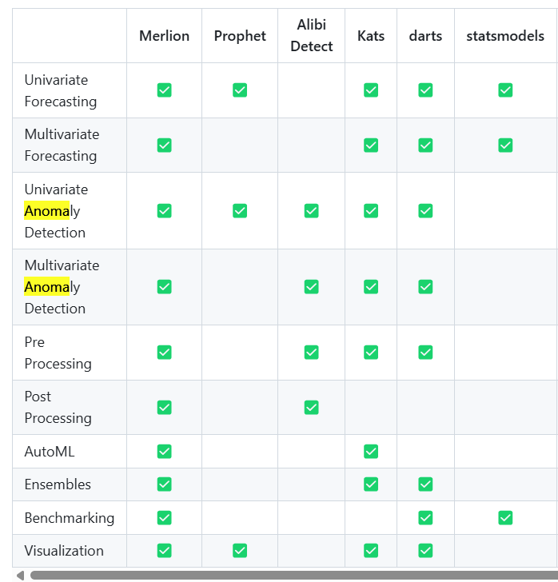

Cours étape par étape que je suis pour progresser en data science appliquée aux time series. 

C'est une première approche pour moi des time series, que je continuerai d'approfondir après ce cours notamment d'un point de vue des technos modernes comme Darts (Unit8), Merlion (Salesforce) et Kats (Meta). 

Statsmodels et Prophet sont plus basiques comme on peut le voir ci-dessous, je vais donc pratiquer mais sans trop m'y attarder pour privilégier les technos modernes.

Par ailleurs Darts semble tout à fait adapté à mes usecases : "A python library for user-friendly forecasting and anomaly detection on time series."
Merlion aussi, qui met lui aussi l'emphase sur l'anomaly detection appliquée aux time series.